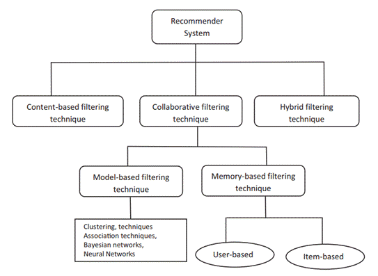
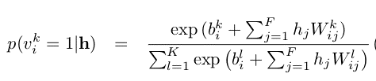

# Recommender System using RBM

## What are Recommender Systems

Recommendation systems describe the **techniques** used to predict ratingsand opinions in which a user might have a propensity to express choice.

A recommender system is a technology that is deployed in the **environment** where **_items_** _(products, movies, events, articles)_ are to be recommended to **_users_** _(customers, visitors, app users, readers)_ or the opposite.

## Approaches to Recommender Systems

## Approaches to Recommender Systems

## RBM vs Neural Networks

The 1 st layer of the RBM is called the visible, or input, layer, and the second is the hiddenlayer.

## What is RBM?

Boltzmann machine or a undirectedgraphical model, is a set ofrandom variables having a Markov property

RBM: restrict BMs to those without visible-visible and hidden-hidden connections. Can be bidirectional or unidirectional.

## Project Goal

The existing approaches to collaborative filtering are unable to hand huge data sets. So Iuse a class of 2 layer undirected graphical model called Restricted Boltzmann Machines to model tabular data -which in our case is Movie Ratings given by users.
I used the data sets available on Netflix or IMDB. From the above I aim to predict the ratings for the movies which have not yet been given a rating by the users.

## Reconstruction in RBM’s

Reconstruction estimates a continuousvaluebasedon many inputs and makes guesses about which discrete label to applyto a giveninput.

## Available Dataset

● Netflix dataset from 1998 to 2005

● 3 types of data

○ Training data: 100M ratings from 480k users randomly chosen on 18k movies.

○ Validation data: Containing 1.4M ratings.

○ Test data(probe data): Has 2.8M user/movie pairs without any rating.

https://web.archive.org/web/20090925184737/http://archive.ics.uci.edu/ml/datasets/Netflix+Prize

## Alternative Methods

● Alternating Least Squares for training the model

● Matrix Factorization

● Gradient Descent

● Auto Encoders

## Restricted Boltzmann Machines

Why we use RBM? I in collaborative filtering domain, most of the data sets are sparse and this creates a complex non-convex problem. Thus we use RBM.

If we have M movies, N users and integral ratings from 1-K.

If all N users rated the same set of M movies then we just use a single training case for an RBM which has M softmax visible units symmetrically connected to a set of binary hidden units.

But in case of lot of ratings missing, we model a different RBM for each user.

Every RBM has the same number of hidden units, but an RBM only has visible softmax units for the movies rated by that user, so
an RBM has few connections if that user rated few movies. Each RBM only has a single training case, but all of the corresponding weights and biases are tied together, so if two users have rated the same movie, their two RBM’s must use the same weights between the softmaxvisible unit for that movie and the hidden units.

## Model

● The visible layer consists of x units where x is the number of movies a particular user has rated.

● Each unit in the visible layer is a vector of length 5 ( since ratings are from 1 to 5), and the ithindex is one corresponding to the rating the user has given, the rest are zeros.

● The hidden layer consist of 100 units which are binary.

● The activation function Ihave used is the sigmoid function both for forward propagation and backward propagation.

## Training our RBM

● 2 cycles -Forward propagation and Backward propagation.

● Weights initially have been assigned randomly.

● Forwards propagation -find the positive associations after finding the hidden units.

● Backward propagation -from the hidden units found in forward pro pagation we find the visible units and then again do forward propagation to find the negative associations.

● The difference between the positive and the negative associations gives us Δw the value with which we change the current weights for a user in the RBM.

Gibbs sampling is not a self-contained concept. It requires some prerequisite knowledge:

- Bayes theorem -conditional probability

- Monte Carlo The underlying concept is to userandomnessto solve problems that might bedeterministicin principle.

- Markov model -a stochastic **model** used to **model** randomly changing systems. It is assumed that future states depend only on the current state, not on the events that occurred before it

- Markov Chain Monte Carlo

**Training RBM’s has difficult Theory**

## Learning

**Contrastive Divergence**
We follow an approximation to the gradient of a different objective function called CD. Expectation T represents a distribution of samples from running the Gibbs sampler.

## Forward Propagation -

## Backward Propagation -

### Making Predictions

We compute the probabilities for each rating from 1-5.

The maximum probability from the calculated values gives us the rating which a particular user would give that movie.

## Results

Used mean square error

## References

https://towardsdatascience.com/introduction-to-recommender-systems-
6c66cf15ada

https://web.archive.org/web/20090925184737/http://archive.ics.uci.edu/ml/dataset
s/Netflix+Prize

https://tryolabs.com/blog/introduction-to-recommender-systems/

https://towardsdatascience.com/restricted-boltzmann-machines-simplified-
eab1e

https://towardsdatascience.com/deep-learning-meets-physics-restricted-
boltzmann-machines-part-i-6df5c4918c

## THANK YOU :)

